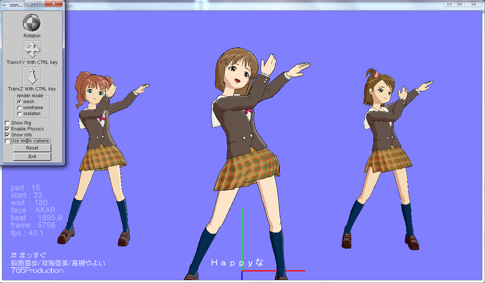
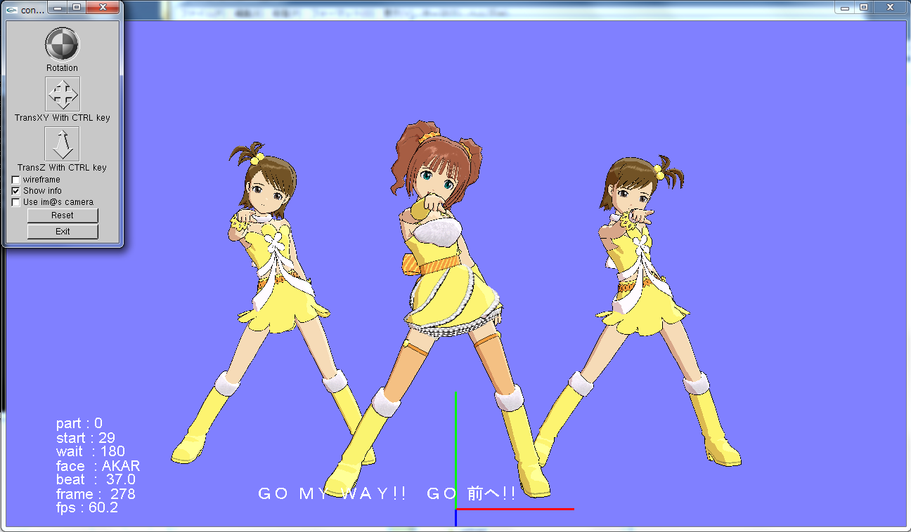
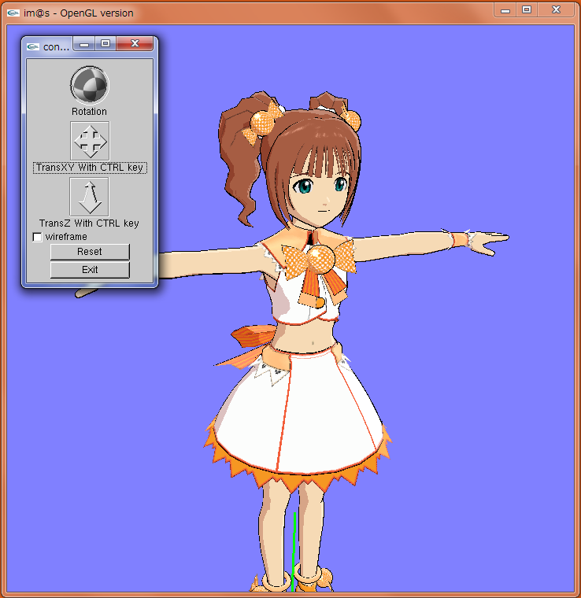
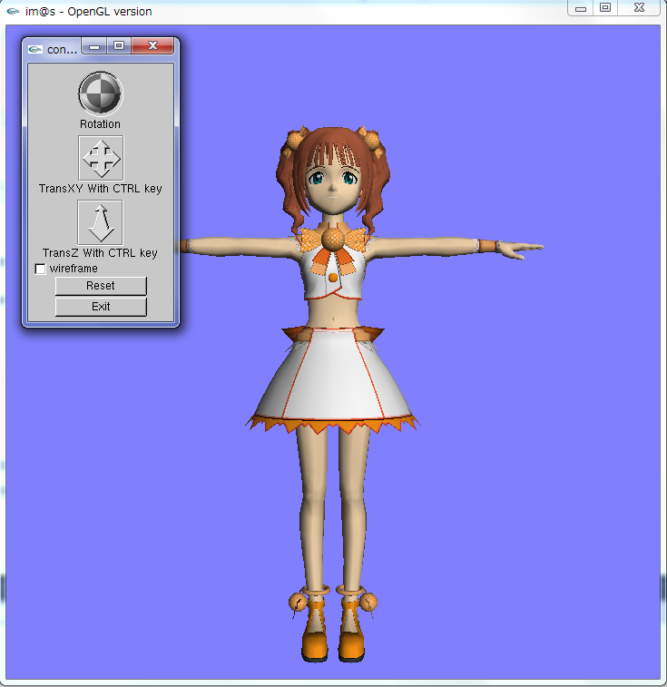
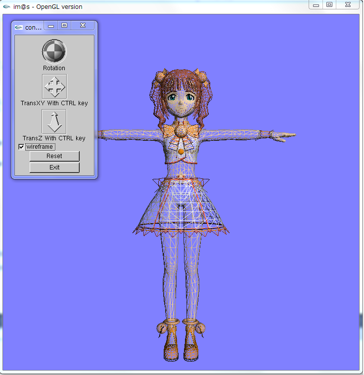

# im@s360 viewer

# Overview

Dance stage viewer of "THE IDOLM@STER"(Xbox360) and "THE IDOLM@STER LIVE FOR YOU!"(Xbox360).

# Description

This software is the dance stage viewer "THE IDOLM@STER"(Xbox360) and "THE IDOLM@STER LIVE FOR YOU!"(Xbox360). 

- Rendering character 3D model
- dance motion with physics simulation
- lip-synch
- Facial expression
- play song and music
- lyrics
- you can move camera

Skinning correction is not implemented yet. So sometimes "candy-wrapper" phenomenon will be seen.

This software is developed referencing some other viewer (not distributed anymore).  
Most efforts to analyze file formats were made by great forerunners.

# Usage

You need to do ripping data from Xbox360 disk before using.  
Executable file is in release directory.  
Rewrite the setting.ini file.

The following is the sample of setting.ini.  
Write the paths of character bna files in CharaBNA* section,  
and dance motion bna file in danceBNA section,  
and staticmot.bna file in staticmotBNA section,  
and music file in aix section.

    [path]
    CharaBNA1=C:\GAMES\L4U\root\chara\yay\yay_cute_05.bna
    CharaBNA2=C:\GAMES\L4U\root\chara\mam\mam_cute_05.bna
    CharaBNA3=C:\GAMES\L4U\root\chara\ami\ami_cute_05.bna
    danceBNA=C:\GAMES\L4U\root\dancemot\gmw.bna
    staticmotBNA=C:\GAMES\L4U\root\staticmot.bna
    aix=C:\GAMES\L4U\root\song\song_gmw.aix

# Requirement

- Windows  
- GLUT, GLUI .... User interface library of OpenGL  
- libsquish .... decode DXT format [https://sourceforge.net/projects/libsquish/](https://sourceforge.net/projects/libsquish/)  
- DirectX9 .... using library for vector, matrix, quartenion  
- Cg .... shader  

# Demo

## Release 1.1

- Physics simulation

## Release 1.0

- Dance motion, song and music, lyrics

## Release 0.1
Rendering with Cg shader

## Release 0.0
Simple model viewer

